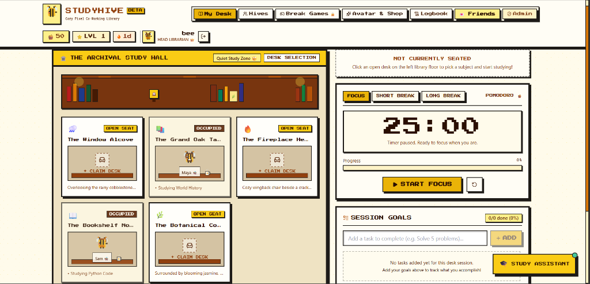
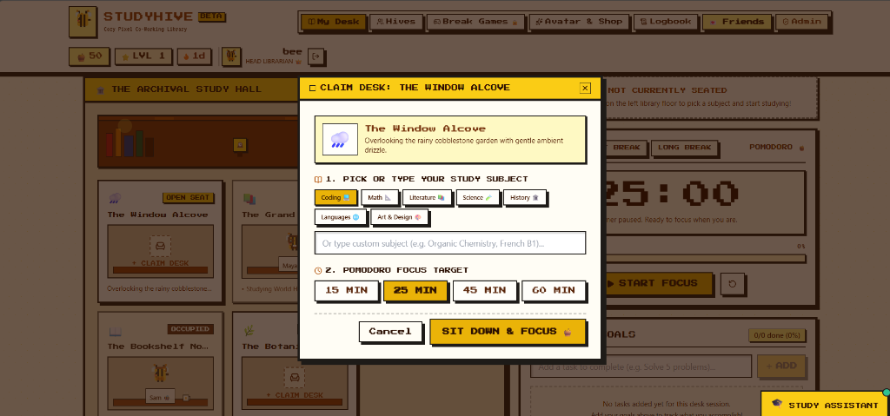
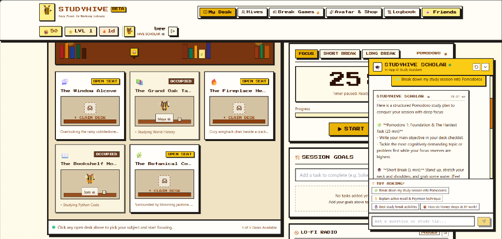
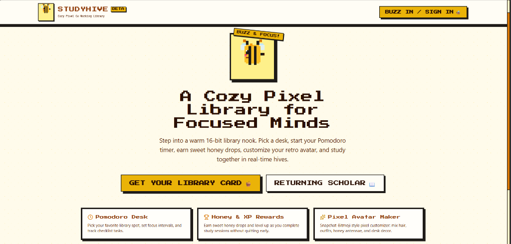
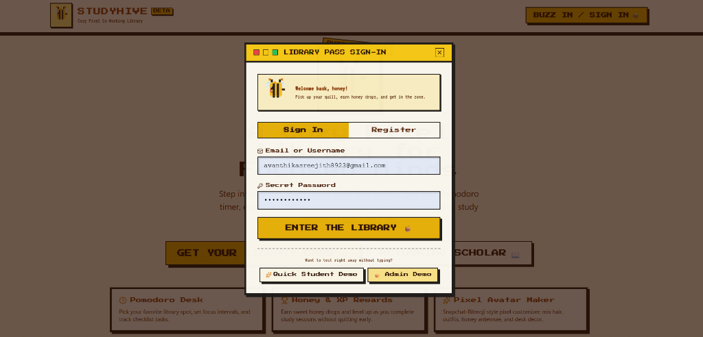
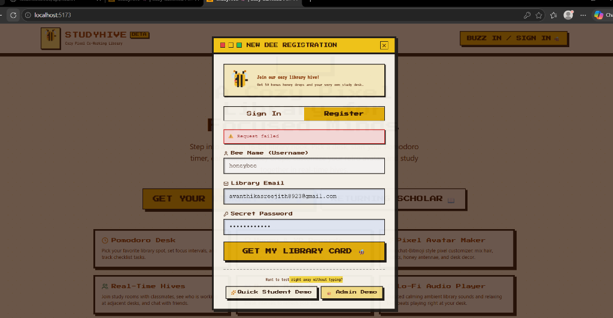

# 🐝 StudyHive
### *A Cozy Gamified Pixel Co-Working Library for Focused Minds*

[](https://react.dev/)
[](https://vitejs.dev/)
[](https://nodejs.org/)
[](https://expressjs.com/)
[](https://www.mongodb.com/)
[](https://socket.io/)
[](LICENSE)

---

## 📖 Overview

**StudyHive** is a full-stack, gamified co-working platform designed to transform solitary study sessions into an engaging, collaborative journey. Blending nostalgic 16-bit RPG aesthetics with modern productivity science, StudyHive places students and scholars into a tranquil virtual library.

Users claim seats at themed library desks, run structured Pomodoro focus cycles, track real-time study goals, accumulate sweet **Honey drops** and **XP**, customize retro pixel avatars, collaborate in synchronized multiplayer **Hives**, play unlockable break mini-games, and receive instant academic guidance from an integrated AI study companion.

---

## 📸 Interface Showcase

### 🏛️ The Archival Study Hall & Focus Mode
| The Archival Study Hall | Desk Claim & Focus Setup | Live Session & Study Assistant |
| :---: | :---: | :---: |
|  |  |  |
| *Interactive 5-desk study room featuring live Pomodoro timers, seated avatars, and goal checklists.* | *Choose study subjects and configure structured focus targets from 15 to 60 minutes.* | *In-session study companion providing Pomodoro breakdowns and learning guidance directly at your desk.* |

### 🐝 Scholar Authentication & Entrance
| Welcome & Landing Portal | Library Pass Sign-In | New Scholar Registration |
| :---: | :---: | :---: |
|  |  |  |
| *Retro 16-bit entrance and features tour.* | *Pass sign-in with quick access demos.* | *Registration with starter Honey drops bonus.* |

---

## ✨ Key Features

### 🔐 Authentication & Account Management
- **Token-Based Security:** Secure JSON Web Token (JWT) authentication with cryptographically hashed passwords (`bcryptjs`).
- **Data Protection:** Passwords safely excluded from API responses and database queries.
- **Role-Based Access Control:** Distinct privileges for scholars and administrators ("Head Librarians").

### 📖 Study Desks & Focus Engine
- **Thematic Library Spots:** Choose between distinct work environments including *The Window Alcove*, *The Grand Oak Table*, *The Fireplace Hearth*, *The Bookshelf Nook*, and *The Botanical Corner*.
- **Focused Desk Zoom View:** Selecting an open desk transitions into an immersive personal nook with ambient visuals, timers, and customized workspace decor.
- **Configurable Pomodoro Timer:** Select 15, 25, 45, or 60-minute focus blocks alongside scheduled short and long breaks with gentle 8-bit web audio chimes.
- **Session Goals Checklist:** In-session task management with interactive completion tracking and progress indicators.
- **Scholar Study Logbook:** Historical record tracking completed study sessions, focus durations, subjects, and earned rewards.

### 🍯 Gamification & Pixel Avatars
- **Honey Drops & XP Economy:** Earn honey drops (`🍯`) and experience points (`⭐`) for completing productive sessions without abandoning tasks early.
- **Pixel Character Customizer:** Retro pixel avatar editor with selectable hairstyles, cozy outfits, bee antennae, glasses, and desk accessories.
- **Honey Shop & Wardrobe:** Spend accumulated Honey currency to unlock rare cosmetic items and desk plants.

### 🐝 Real-Time Multiplayer Hives
- **Synchronized Study Rooms:** Live co-working spaces powered by WebSockets featuring shared timers, participant lists, and unique join codes.
- **Atomic Desk Seating:** Concurrency-safe seat claiming to prevent duplicate occupancy across concurrent sessions.
- **Presence & Multi-Tab Support:** Real-time online presence detection with automatic reconnect grace handling.
- **Direct Messaging:** Private peer-to-peer messaging restricted to mutual scholar connections.

### 🎮 Break Mini-Games & Ambient Audio
- **Pomodoro-Locked Mini-Games:** Entertainment modules (Memory Match and 2048 Honey Tiles) automatically unlock only during scheduled break intervals and pause when focus resumes.
- **Lo-Fi Audio Player:** Integrated soundscapes featuring gentle rain, fireplace crackles, library ambient noise, and relaxing lo-fi beats.

### 🎓 AI Study Assistant & Admin Moderation
- **StudyHive Scholar AI:** Built-in study companion offering step-by-step topic breakdowns, Pomodoro scheduling suggestions, and learning techniques.
- **Head Librarian Dashboard:** Dedicated administrative moderation panel to monitor live platform activity, inspect active study hives, and manage scholar accounts.

---

## 🛠️ Architecture & Tech Stack

```
studyhive/
├── client/                 # Frontend React Application
│   ├── src/
│   │   ├── components/     # UI components (library, hives, avatar, shop, audio, assistant)
│   │   ├── context/        # Global state providers (Auth, Socket, Theme)
│   │   └── services/       # API clients and WebSocket integrations
│   └── public/             # Static assets, retro sprites, and fonts
└── server/                 # Backend Node.js & Express API
    ├── src/
    │   ├── config/         # Database and server configuration
    │   ├── controllers/    # Business logic handlers
    │   ├── middleware/     # Auth verification, rate limiting, and input validation
    │   ├── models/         # Mongoose database schemas
    │   ├── routes/         # RESTful API route definitions
    │   └── socket/         # Real-time WebSocket event handlers
    └── scripts/            # Administrative CLI tools
```

| Layer | Technologies |
| :--- | :--- |
| **Frontend** | React 18, Vite, Tailwind CSS, Retro Pixel CSS Tokens, Socket.io Client, Lucide Icons, Canvas Confetti |
| **Backend** | Node.js (ES Modules), Express 5, Socket.io, JSON Web Tokens, Bcrypt, Express Rate Limit, Express Validator |
| **Database** | MongoDB with Mongoose ODM (includes zero-config in-memory fallback for immediate testing) |
| **Typography** | Google Fonts (*Press Start 2P*, *VT323*, *Inter*) |

---

## 🚀 Installation & Setup

### Prerequisites
- **Node.js** (v18.x or later)
- **npm** (v9.x or later)
- **MongoDB** *(Optional — the server will automatically provide an in-memory database if no external database instance is detected)*

### 1. Clone the Repository
```bash
git clone https://github.com/avanthikasreejith8923-a11y/studyhive.git
cd studyhive
```

### 2. Install Dependencies
Install all required packages across both client and server:
```bash
npm run install:all
```

### 3. Environment Configuration
Copy the provided environment templates and configure your application parameters:

- **Server:** Copy `server/.env.example` to `server/.env` to configure your database connection, secret keys, and service settings.
- **Client:** Copy `client/.env.example` to `client/.env` to configure your client application endpoints.

### 4. Run the Application
Launch both the backend API and frontend client concurrently:
```bash
npm run dev
```

The application client will open in your default browser.

---

## 🛡️ Administrative Console & Promotion

StudyHive includes a role-based moderation system. To elevate an account to **Head Librarian** (Admin):

1. Register an account within the application.
2. In your terminal, navigate to the `server/` folder and execute the promotion script:
   ```bash
   node scripts/makeAdmin.js <username_or_email>
   ```
3. Upon signing in, the designated account will gain access to the **Admin** dashboard in the navigation bar.

---

## 🔒 Security & Quality Standards

- **Input Sanitization:** All incoming requests (chat messages, usernames, hive names, task titles) are strictly sanitized against injection attacks.
- **Socket Authentication:** WebSocket connections require verified JWT tokens upon connection; unauthenticated handshakes are rejected.
- **Rate Limiting:** Critical endpoints (authentication, account creation, assistant requests) are protected against automated abuse.
- **Atomic Operations:** Desk claiming and currency transactions employ atomic check-and-set operations to prevent race conditions.

---

## 📄 License

This project is licensed under the [MIT License](LICENSE). You are free to study, modify, and distribute this software.
